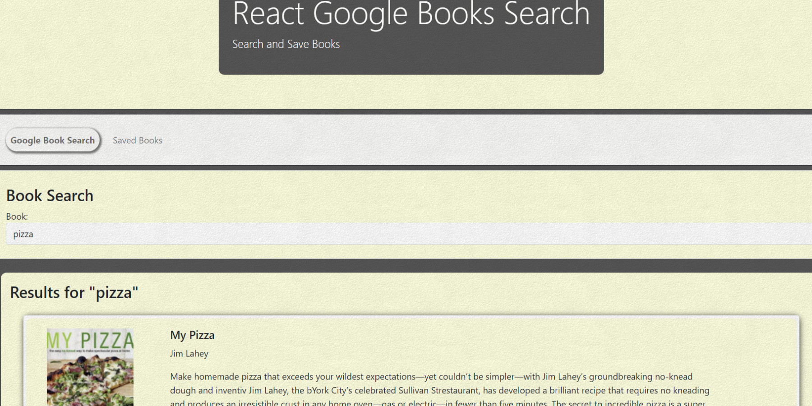

# ReactGoogleBookSearch - 

This deployed app can be viewed <a href="https://react-google-books-search-01.herokuapp.com/" target="_blank">Here</a>

    
    
    
    

  

    
    
    
    
    

## DESCRIPTION

This is a great App demonstrating knowledge and skills with React.js, JavaScript, MongoDB, CSS, HTML, and Heroku.

## TABLE OF CONTENTS

- [Description](#description)
- [Installation](#Installation)
- [License](#License)
- [Usage](#Usage)
- [Credits](#Credits)
- [Contributing](#Contributing)
- [Tests](#Tests)
- [DevTeam](#Team)

## INSTALLATION

To install the dependencies necessary for this project, run the following command:

Please use `npm i` to install node dependencies

## LICENSE

- This project is licensed under the MIT license.

## USAGE

- This project requires Requires node v14+ to run.

## Credits

Credit for the app's star rating system goes to Andrew Bliss on CodePen.io.

## CONTRIBUTING

- Pull requests are welcome. For major changes, please open an issue first to discuss what you would like to change.
- Please make sure to update tests as appropriate.

## TEAM

Steve LeValley - Github: [sjlevalley](https://www.github.com/sjlevalley) 
